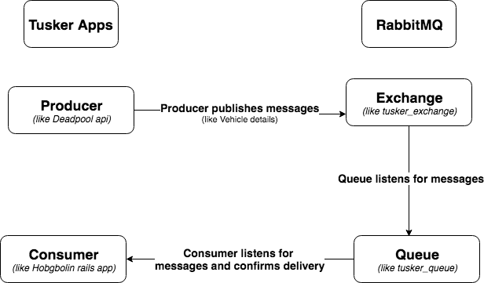

# BlackPanther

Is a gem that standardises communication between Tusker applications, especially how they produce and consume messages from/to RabbitMQ.

BlackPanther handles  the boiler plate code that communicates with RabbitMQ. It also helps with the definition and compilation of `protobuf` instances.

RabbitMQ is a messaging bus (with its own framework) that facilitates the broadcast of messages that are consumed by other applications.

The first use case which will have Deadpool publishing the vehicle related data (mostly from kee resources), so that applications such as Hobgbolin can be passed messages.

Developers using this gem are expected to provide the configuration for connection to RabbitMQ.

## Nomenclature



- **Producer**: an application (like Deadpool api) that publishes messages to RabbitMQ.
- **Message**: an object sent over RabbitMQ. It consists of a delivery information, message properties and message/payload. In the case of the Deadpool api the payload can be vehicle related details.
- **Consumer**: the app subscribes and listens for messages and goes ahead to process the messages it receives.
- **Exchange**: In the RabbitMQ's framework, producers can publish messages to an exchange.
  Consumers link up to a Queue that listens to the exchange. This is of benefit as the queue can then buffer messages, making sure that messages are sent to the consumer.
- **Queue**: a queue basically listens to an exchange. Mostly the queue will listen
  to every messages, however there is a chance  that the queue can listen for messages in a specific pattern.

## Assumption(s)

- The exchange to be used should be setup with 'Durability' set to Durable. See line 32 in Consumer class.

## Dependencies

- [Bunny](https://github.com/ruby-amqp/bunny).

## Setup and Installation

To get started install `protobuf`:

    $ brew install protobuf

To install simply run:

And then execute:

    $ bundle

Or install it yourself as:

    $ gem install black_panther

To include in your rails or ruby project, add the following line to your Gemfile.

```ruby
gem 'black_panther', git: 'https://github.com/tusker-direct/black_panther'
```

## Usage

Create a YAML configuration file in your rails app at `config/black_panther.yml`:

```
default: &default
  host: 'localhost'
  port: 5672
  user: 'guest'
  password: 'guest'
  recover_from_connection_close: true
  exchange: 'tusker_exchange'
  queue: 'tusker_queue'
  routing_key: 'deadpool.message'

development:
  <<: *default

test:
  <<: *default

production:
  <<: *default

```

To compile `protobuf` files run:

    $ bundle exec rake black_panther:compile

To instantiate an AMQP object:

```ruby
 amqp = BlackPanther::Amqp.new(Rails.env) # if Rails.env isn't supplied development is used as default environment.
```

To send a message with a producer:

```ruby
  amqp.producer.send(Manufacturer.new)
  or
  amqp.producer.send(Manufacturer.new, persistent: true) # this also offers the opportunity to override configuration details that are not connection related.
```

To listen to message via a queue with a consumer:

```ruby
  amqp.consumer.subscribe do |message|
    # Do something with message
    # Acknowledge Retry or Discard (i.e message.(ack!|retry!|discard!))
  end
```
